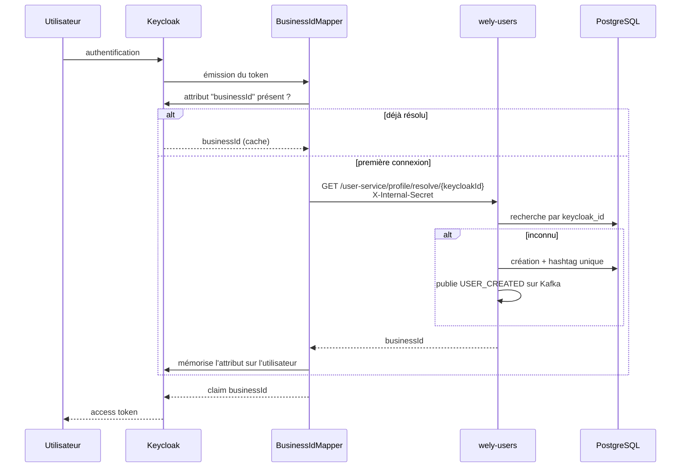

# wely-identity

Configuration Keycloak de la plateforme [Wely Calendar](https://github.com/WelyLabs/wely-platform) : export du realm, thème, et un **plugin Java custom** qui fait le pont entre l'identité Keycloak et l'identité métier.

---

## Le problème résolu

Keycloak connaît un utilisateur par son UUID d'IdP. L'application le connaît par un UUID métier stocké en PostgreSQL. Trois options se présentaient :

| Option | Inconvénient |
|---|---|
| Chaque service traduit l'UUID à chaque requête | Un appel réseau supplémentaire sur **chaque** requête de **chaque** service |
| Un webhook Keycloak à la création d'utilisateur | Fragile, asynchrone, et muet sur les utilisateurs créés hors application (console admin, fédération) |
| **Injecter l'identifiant métier dans le token** | Retenu |

Un **mapper de protocole Keycloak** enrichit le token à l'émission. Les services lisent `jwt.getClaimAsString("businessId")` et n'ont plus jamais à traduire quoi que ce soit.

---

## `BusinessIdMapper`

Plugin Java déployé dans Keycloak (`plugins/business-id-mapper/`), enregistré comme `ProtocolMapper` via le SPI standard.



### Deux propriétés notables

**Le provisioning est paresseux (JIT).** L'utilisateur métier est créé au moment de la première émission de token, pas avant. Aucun batch de synchronisation, aucun webhook : tout utilisateur capable d'obtenir un token existe forcément côté application, quelle que soit la façon dont son compte Keycloak a été créé.

**La résolution n'a lieu qu'une fois.** Le résultat est mémorisé comme attribut utilisateur Keycloak ; les émissions suivantes lisent le cache sans appel réseau. Le coût est donc d'un seul appel HTTP dans la vie d'un compte.

### Découverte de l'URL

```java
String baseUrl = System.getenv("USERS_API_URL");
if (baseUrl == null || baseUrl.isBlank()) {
    baseUrl = isLocalDev ? "http://host.docker.internal:8082"   // Docker Compose
                         : "http://wely-users-service:8082";     // Kubernetes
}
```

La variable d'environnement est injectée par Kubernetes ; le repli couvre le développement local.

---

## Contenu du dépôt

```
├── wely-realm.json          export du realm (clients, rôles, flows, mappers)
├── Dockerfile                       image Keycloak + plugin + thème
├── plugins/
│   └── business-id-mapper/          plugin Java (Maven)
│       └── src/main/
│           ├── java/com/calendar/BusinessIdMapper.java
│           └── resources/META-INF/services/
│               └── org.keycloak.protocol.ProtocolMapper    ← enregistrement SPI
├── themes/                          thème de connexion personnalisé
├── MAPPER_CONFIGURATION.md          configuration du mapper dans la console
└── CI-CD-PLAN.md                    stratégie de livraison
```

---

## Build

```bash
cd plugins/business-id-mapper
./mvnw package                       # → target/keycloak-1.0-SNAPSHOT.jar
```

Le `Dockerfile` construit une image Keycloak avec le JAR déposé dans `/opt/keycloak/providers/` et le thème dans `/opt/keycloak/themes/`.

---

## Démarrage local

Depuis la racine du projet :

```bash
docker compose up -d
```

Keycloak démarre sur `:8080` en `start-dev`, avec import automatique du realm et stockage `dev-file` local — aucun risque de toucher à une base distante.

---

## Configuration du realm

Le realm `wely-realm` définit :

- le client public **`wely-client`** utilisé par le frontend (flow OIDC) ;
- le client confidentiel **`wely-users-api-client`** (`client_credentials`) permettant à `wely-users` d'appeler l'Admin API ;
- le mapper **`businessId`** attaché au client frontend, qui injecte le claim.

Voir [`MAPPER_CONFIGURATION.md`](MAPPER_CONFIGURATION.md) pour la procédure de configuration dans la console.

### Secret du client confidentiel

L'export porte `"secret": "${KC_CLIENT_SECRET}"` pour `wely-users-api-client`. Keycloak résout les placeholders `${VARIABLE}` depuis l'environnement **au moment de l'import**, donc aucun secret réel n'est versionné et aucune étape manuelle n'est nécessaire : il suffit que `KC_CLIENT_SECRET` soit présent dans l'environnement du conteneur Keycloak, et qu'il corresponde à `KEYCLOAK_CLIENT_SECRET` côté `wely-users`.

Sur un realm déjà existant, la valeur se change dans la console, ou :

```bash
kcadm.sh update clients/$(kcadm.sh get clients -r wely-realm \
    -q clientId=wely-users-api-client --fields id --format csv --noquotes) \
  -r wely-realm -s secret="$KEYCLOAK_CLIENT_SECRET"
```

### Import du realm

`wely-realm.json` est copié dans l'image, sous `/opt/keycloak/data/import/`. Il n'est lu que si le conteneur démarre avec `--import-realm`, ce que fait l'overlay `local` et que ne font ni `dev` ni `prod`.

Keycloak **ignore un realm déjà existant** à l'import, donc le drapeau est sans danger ; il reste malgré tout hors des environnements dont le realm porte un état réel.

> **L'export ne contient aucun identifiant.** Les quatre comptes qui portaient des hachages de mots de passe en ont été retirés : un Keycloak local démarre sans utilisateur, et on s'inscrit depuis l'application — ce qui est aussi le chemin qui exerce le *provisioning* JIT autour duquel ce projet est construit.

---

## Limites connues

- **Un secret réel figure encore dans l'historique Git de ce dépôt.** Il a été révoqué le 2026-10-01 : le secret du client a été régénéré via l'API Admin et rescellé. L'export courant ne porte qu'un placeholder.
- **Appel HTTP bloquant** dans le mapper (`HttpURLConnection`, timeout 3 s) — acceptable puisque Keycloak n'est pas réactif et que l'appel n'a lieu qu'une fois par compte, mais il ajoute une dépendance dure : si `wely-users` est indisponible lors d'une première connexion, le token est émis sans `businessId`.
- **Journalisation via `System.out`** plutôt qu'un logger.
