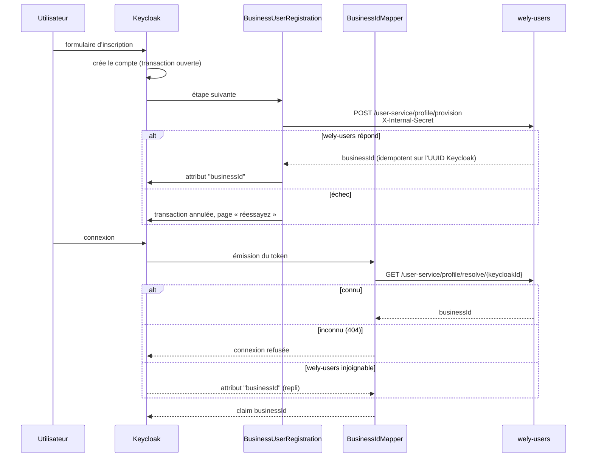

# wely-identity

Configuration Keycloak de la plateforme [Wely Calendar](https://github.com/WelyLabs/wely-platform) : export du realm, thème, et un **plugin Java custom** qui fait le pont entre l'identité Keycloak et l'identité métier.

---

## Le problème résolu

Keycloak connaît un utilisateur par son UUID d'IdP. L'application le connaît par un UUID métier stocké en PostgreSQL. Trois options se présentaient :

| Option | Inconvénient |
|---|---|
| Chaque service traduit l'UUID à chaque requête | Un appel réseau supplémentaire sur **chaque** requête de **chaque** service |
| Un webhook Keycloak à la création d'utilisateur | Fragile, asynchrone, et muet sur les utilisateurs créés hors application (console admin, fédération) |
| **Injecter l'identifiant métier dans le token** | Retenu |

Un **mapper de protocole Keycloak** enrichit le token à l'émission. Les services lisent `jwt.getClaimAsString("businessId")` et n'ont plus jamais à traduire quoi que ce soit.

---

## Création des utilisateurs et `businessId`

Le plugin Java (`plugins/business-id-mapper/`) apporte deux briques à Keycloak :

- **`BusinessUserRegistration`**, une étape du formulaire d'inscription (`FormAction`) : elle crée l'utilisateur dans `wely-users` dès que le compte Keycloak existe ;
- **`BusinessIdMapper`**, un `ProtocolMapper` : à chaque émission de token, il lit le `businessId` et l'ajoute au token.



### Trois propriétés notables

**L'utilisateur est créé à l'inscription, et seulement là.** L'étape s'exécute dans la transaction qui crée le compte Keycloak. Si `wely-users` échoue, elle marque cette transaction *rollback-only* avant d'échouer : Keycloak transforme l'exception en page d'erreur et, sans cela, validerait quand même le compte. Il n'existe donc pas de compte Keycloak sans utilisateur Wely. Un compte créé autrement (console d'administration) doit être provisionné explicitement, comme le compte de démo.

**La connexion ne fait que lire.** Le mapper interroge `wely-users` — une requête indexée sur `keycloak_id` — et n'écrit rien. Créer l'utilisateur pendant l'émission du token, avec un délai de 3 s, laissait une première connexion lente échouer sur une page blanche (2026-10-10).

**`wely-users` fait foi, l'attribut Keycloak n'est qu'un repli.** L'identifiant est recopié dans un attribut de l'utilisateur Keycloak, qui ne sert que si `wely-users` est injoignable. Un utilisateur que `wely-users` ne connaît pas est refusé, attribut ou pas : le 2026-10-02, la table `app_user` de dev a été vidée par erreur, et une version qui lisait l'attribut d'abord a continué d'émettre des tokens pour des identifiants disparus.

### Découverte de l'URL

```java
String baseUrl = System.getenv("USERS_API_URL");
if (baseUrl == null || baseUrl.isBlank()) {
    baseUrl = isLocalDev ? "http://host.docker.internal:8082"   // Docker Compose
                         : "http://wely-users-service:8082";     // Kubernetes
}
```

La variable d'environnement est injectée par Kubernetes ; le repli couvre le développement local.

---

## Contenu du dépôt

```
├── wely-realm.json          export du realm (clients, rôles, flows, mappers)
├── Dockerfile                       image Keycloak + plugin + thème
├── plugins/
│   └── business-id-mapper/          plugin Java (Maven)
│       └── src/main/
│           ├── java/com/calendar/
│           │   ├── BusinessUserRegistration.java  étape d'inscription : crée l'utilisateur
│           │   ├── BusinessIdMapper.java          le mapper, branché sur Keycloak
│           │   ├── BusinessIdResolver.java        wely-users d'abord, attribut en repli
│           │   └── UsersServiceClient.java        appels HTTP à wely-users
│           └── resources/META-INF/services/       ← enregistrement SPI des deux briques
├── themes/                          thème de connexion personnalisé
├── MAPPER_CONFIGURATION.md          configuration du mapper dans la console
└── CI-CD-PLAN.md                    stratégie de livraison
```

---

## Build

```bash
cd plugins/business-id-mapper
./mvnw package                       # tests + target/keycloak-1.0-SNAPSHOT.jar
```

Le `Dockerfile` construit une image Keycloak avec le JAR déposé dans `/opt/keycloak/providers/` et le thème dans `/opt/keycloak/themes/`.

---

## Démarrage local

Depuis la racine du projet :

```bash
docker compose up -d
```

Keycloak démarre sur `:8080` en `start-dev`, avec import automatique du realm et stockage `dev-file` local — aucun risque de toucher à une base distante.

---

## Configuration du realm

Le realm `wely-realm` définit :

- le client public **`wely-client`** utilisé par le frontend (flow OIDC) ;
- le client confidentiel **`wely-users-api-client`** (`client_credentials`) permettant à `wely-users` d'appeler l'Admin API ;
- le mapper **`businessId`** attaché au client frontend, qui injecte le claim.

Voir [`MAPPER_CONFIGURATION.md`](MAPPER_CONFIGURATION.md) pour la procédure de configuration dans la console.

### Secret du client confidentiel

L'export porte `"secret": "${KC_CLIENT_SECRET}"` pour `wely-users-api-client`. Keycloak résout les placeholders `${VARIABLE}` depuis l'environnement **au moment de l'import**, donc aucun secret réel n'est versionné et aucune étape manuelle n'est nécessaire : il suffit que `KC_CLIENT_SECRET` soit présent dans l'environnement du conteneur Keycloak, et qu'il corresponde à `KEYCLOAK_CLIENT_SECRET` côté `wely-users`.

Sur un realm déjà existant, la valeur se change dans la console, ou :

```bash
kcadm.sh update clients/$(kcadm.sh get clients -r wely-realm \
    -q clientId=wely-users-api-client --fields id --format csv --noquotes) \
  -r wely-realm -s secret="$KEYCLOAK_CLIENT_SECRET"
```

### Import du realm

`wely-realm.json` est copié dans l'image, sous `/opt/keycloak/data/import/`. Il n'est lu que si le conteneur démarre avec `--import-realm`, ce que fait l'overlay `local` et que ne font ni `dev` ni `prod`.

Keycloak **ignore un realm déjà existant** à l'import, donc le drapeau est sans danger ; il reste malgré tout hors des environnements dont le realm porte un état réel.

> **L'export ne contient aucun identifiant.** Les quatre comptes qui portaient des hachages de mots de passe en ont été retirés : un Keycloak local démarre sans utilisateur, et on s'inscrit depuis l'application — ce qui est aussi le chemin qui exerce l'étape de création de `wely-users`.

---

## Limites connues

- **Un secret réel figure encore dans l'historique Git de ce dépôt.** Il a été révoqué le 2026-10-01 : le secret du client a été régénéré via l'API Admin et rescellé. L'export courant ne porte qu'un placeholder.
- **Appels HTTP bloquants** (`java.net.http`) — Keycloak n'est pas réactif, il n'y a rien à qui rendre un résultat asynchrone. Lecture à chaque token : 3 s, avec l'attribut en repli. Création à l'inscription : 10 s, car on attend un formulaire et non un token. Si `wely-users` répond après le délai, il peut garder un utilisateur dont le compte Keycloak a été annulé : sans conséquence pour la connexion, mais une ligne orpheline.
